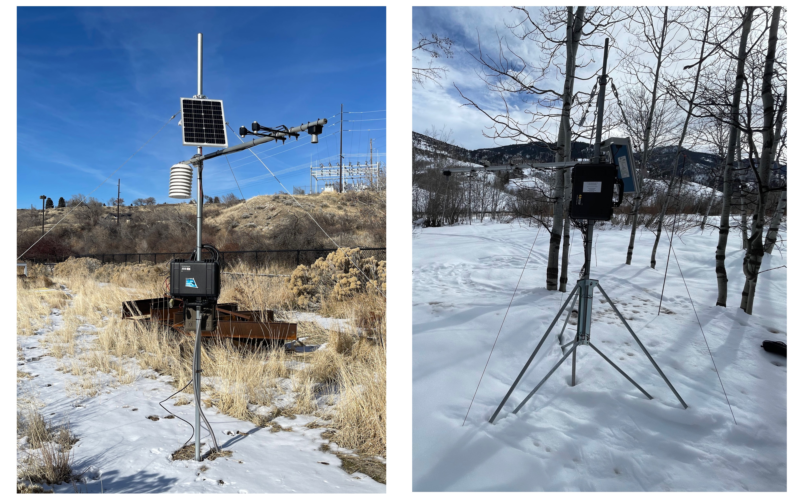

# Deployment Platform

Choosing a deployment platform is important as a first step because it dictates the components you will buy along with how the sensors are hardware are mounted to your deployment platform. We experimented with two deployment platforms:
1. Campbell Scientific or other commercial instrumentation tripods or towers - e.g., the [Campbell Scientific CM106B](https://www.campbellsci.com/cm106b).
2. A lower cost alternative constructed from parts easily sourced at a local hardware or home-goods store.

The following are examples of the two different platforms - Campbell Scientific tripod (right), lower cost alternative (left).

If you have existing instrumentation tripods or towers available, we recommend them for deployment because they are relatively easy to set up and provide a robust platform for mounting sensors. However, they are heavy and expensive. The [construction guide](construction_guide.md) for the sensing platform provides instructions for building a station using the lower-cost alternative deployment platform. 

**NOTE**: Sensor mounting and setup via a sensor crossarm is similar for both deployment platforms. While we do not cover setting up a commerical instrumentation tripod or tower, you will want to consult the [construction guide](construction_guide.md) for information on mounting sensors and enclosures to the sensor crossarm and mast.

[Back to the Getting Started Guide](../docs/getting_started.md)